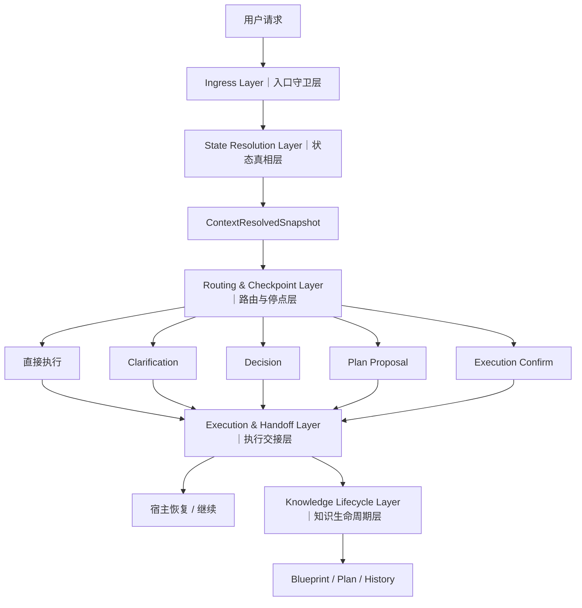

# 蓝图架构与契约

本文定位: 定义 blueprint 的分层方式、runtime 架构与核心消费/停点契约，作为宿主与 runtime 的共同设计基线。

## 正式结论

1. `blueprint/README.md` 只保留入口索引与状态，不承载长说明。
2. 长期知识层固定为 `project.md + blueprint/{background,design,tasks}`。
3. `plan/` 是活动工作层，`history/` 是显式 finalize 后才出现的归档层。
4. `knowledge_sync` 是唯一正式同步契约；`blueprint_obligation` 只保留 legacy reject / projection 语义。
5. `active_plan` 的正式解析口径是 `current_plan.path + current_plan.files`。

## 第一性原理分层结论

- `user/preferences.md` 承载当前 workspace 的协作风格试运行，包括第一性原理纠偏和局部“两段式协作”偏好。
- `analyze` 只吸收可复用的稳定子集：目标/路径分离、目标模糊先澄清、次优路径给替代、SMART 风格成功标准收口。
- `consult/runtime` 输出层保留为二期配置化能力；“所有问答都两段式输出”不进入当前默认契约。
- promotion gate 的后续跨仓库 Batch 2/3 只用于优化 trigger matrix、示例边界和 threshold 校准，不反向改写本轮 `v1` 分层边界。
- `45` 样本 / `3` 类环境的 round-1 pilot 已完成独立 decision pass，并以 `propose-promotion` 作为正式结论；后续只保留 wording/examples 校准，不再回退本轮 promotion 决策。

## 目录分层

Sopify 的知识与运行态继续按五层组织：

- `L0 index`: `blueprint/README.md`，只暴露入口与状态。
- `L1 stable`: `project.md + blueprint/{background,design,tasks}`，承载长期知识与稳定契约。
- `L2 active`: `plan/YYYYMMDD_feature/`，承载当前活动方案与机器元数据。
- `L3 archive`: `history/index.md + history/YYYY-MM/...`，只在显式 finalize 后承载归档。
- `runtime`: `state/*.json + replay/`，承载运行态 machine truth 与可选学习记录。

更细的路径职责、创建时机与 Git 默认策略，以下文 `KB 职责矩阵` 为准。

## Runtime 架构

Sopify 不把开发过程视为一段可以无限续写的聊天上下文，而是把每一轮请求放进一条可恢复的 runtime 主链路：先校验入口，再统一解析当前状态真相，再决定是直接执行还是进入明确的 checkpoint，最后把结果写回结构化 handoff 和项目知识。这样设计的目标，不是增加流程感，而是让复杂任务在跨轮、跨会话、被打断之后，仍然保持可恢复、可评审、可持续推进。

当前底层秩序收敛为五层：入口守卫层、状态真相层、路由与停点层、执行交接层、知识生命周期层。它们分别解决“能不能进入”“现在该信什么”“这轮该怎么走”“结果如何交接”“过程如何沉淀”五类问题。

### Core Layers

#### 1. Ingress Layer｜入口守卫层

入口守卫层负责建立每轮请求进入 Sopify runtime 之前的运行边界。它覆盖安装后的接入上下文、workspace preflight、bootstrap、preferences preload，以及正式 runtime 开始前的 gate 校验。

这一层回答的是两个问题：

1. 当前请求能不能安全进入 Sopify runtime。
2. 当前请求应该带着什么最小上下文进入。

从职责上看，入口守卫层只负责“进门前的准备与校验”，不负责业务路由本身，也不负责解释用户意图。它是 Sopify 的入口协议层，而不是执行器。

#### 2. State Resolution Layer｜状态真相层

状态真相层负责收敛“系统现在到底该信哪份状态”。

Sopify 不允许 Router、Engine、Handoff 各自读取底层状态文件并形成不同解释。当前设计要求先读取当前 session、execution truth 与各类 checkpoint 的候选状态，再由 Loader 与 Resolver 统一生成唯一的 `ContextResolvedSnapshot`。从这一刻起，下游模块只消费 snapshot，而不再重复散读 JSON 文件。

这一层的作用，是把“当前真相”从隐式副作用变成显式裁决。它负责状态统一，不负责决定当前请求应该走 direct execution 还是某个 checkpoint，也不负责生成宿主输出。

#### 3. Routing & Checkpoint Layer｜路由与停点层

路由与停点层负责决定当前请求如何推进。

基于 resolved snapshot，runtime 可以进入 direct execution，也可以进入 clarification、decision、plan proposal、execution confirm 等显式 checkpoint。只要事实不足、需要拍板、需要确认是否执行，系统就不会继续向下猜，而是收敛到结构化停点。

这些 checkpoint 的意义，不是“多停几次”，而是把协作中的关键分叉点从聊天语气提升为机器可恢复的交接结构：

- clarification 解决补事实
- decision 解决拍板选路
- plan proposal 解决建包确认
- execution confirm 解决 develop 前最后一次执行确认

这一层负责协作节奏与停点控制，不负责统一状态真相，也不负责长期知识沉淀。

#### 4. Execution & Handoff Layer｜执行交接层

执行交接层负责执行当前 handler，并把结果写成宿主可继续消费的结构化交接。

当请求进入 direct execution 时，Engine 在这一层真正执行当前动作；当请求进入 checkpoint 时，这一层负责将当前停点、下一步要求与上下文摘要写入 `current_handoff.json` 等结构化产物，供宿主恢复与继续。对宿主而言，后续该问什么、等什么、展示什么，优先以 handoff 为准，而不是依赖自由推断。

这一层解决的是“这一轮做了什么，以及下一轮如何继续”。它不负责入口校验，不负责状态裁决，也不负责归档长期知识。

#### 5. Knowledge Lifecycle Layer｜知识生命周期层

知识生命周期层负责把运行过程沉淀成稳定项目资产。

Sopify 采用渐进式物化：

- `bootstrap` 只创建最小骨架
- 进入正式方案流后补齐深层 blueprint
- `finalize` 后才归档进 `history/`

这意味着活动工作、稳定知识和历史归档是三种不同层次的资产，而不是同一个目录下的不同文件名。`plan/` 承载本轮活动方案，`blueprint/` 承载稳定项目认知，`history/` 承载已收口归档；三者相互关联，但不混为一层。

这一层负责资产沉淀，不负责当前轮次的路由判断或冲突恢复。

### Runtime Guarantees

当前 runtime contract 的稳定边界建立在以下保证之上：

- 当前路由真相只解析一次，并在 Router、Engine、Handoff 间一致消费。
- proposal 不再作为当前会话的全局路由真相参与判断。
- execution truth 与 negotiation state 明确分层，不再混用。
- 状态冲突会显式进入 `state_conflict`，而不是默认 silent fail 或直接 fatal。
- `current_run` 与 `current_handoff` 作为同一轮派生结果，需要绑定同一 `resolution_id`，避免半新半旧状态并存。
- `plan/`、`blueprint/`、`history/` 继续保持不同生命周期职责，不被 runtime 混成单层结构。

这些保证的目标，是让复杂协作始终围绕同一个当前真相推进，而不是让不同模块分别持有各自版本的“现在”。

### Active Improvement Areas

当前的主要优化重点，已经不再是底层状态机正确性本身，而是 checkpoint 语境下的宿主侧召回体验。重点包括：

- 区分“只分析一下”和“真的要继续确认”
- 在显式引用 existing plan 时，保持分析型请求不被误升级为阻断路径
- 提升“取消这个 checkpoint”这类局部语境的自然语言理解稳定性
- 补强 first-hop ingress 的独立诊断与宿主可见性闭环

这些优化的目标，是让停点更容易理解，而不是重新定义当前底层分层边界。

### Runtime Flow



### Maintenance Rule

后续涉及 installer、runtime gate、snapshot 解析、router、handoff、execution truth 或 knowledge lifecycle 的正式变更，应同步更新本节。若本节继续膨胀，优先拆分为独立架构文档，并在本文件中保留稳定摘要与入口链接，而不是把 `blueprint/README.md` 扩写成长说明。

## 核心契约

### Runtime state scope

- review state 默认落在 `state/sessions/<session_id>/`，覆盖 `current_plan/current_run/current_handoff/current_clarification/current_decision/last_route`
- 根级 `state/` 继续只承载 global execution truth，主要服务 `execution_confirm_pending / resume_active / exec_plan / finalize_active`
- `session_id` 可以由宿主显式透传，也可以由 runtime gate 自动生成并回传；同一条 review 续轮必须复用同一个 `session_id`
- 并发 review 使用不同 `session_id`；global execution truth 只补 soft ownership 观测字段，不引入 lease / heartbeat / takeover 锁
- clarification / decision bridge 先读 session review state，再回退到 global execution truth，保证 develop 阶段生成的 checkpoint 仍可桥接

### Runtime gate ingress contract

- `persisted_handoff` 继续是 runtime gate 的唯一正向机器证据；`runtime_result.handoff` 只用于诊断归因，不替代 persisted 成功证据。
- `evidence.handoff_source_kind` 的稳定值域固定为：`missing / current_request_not_persisted / reused_prior_state / current_request_persisted / persisted_runtime_mismatch`。
- gate 判定优先级固定为：`strict_runtime_entry_missing` 优先，其次区分 `handoff_missing / handoff_normalize_failed`，最后才由 `handoff_source_kind` 决定 `ready` 或 source-kind-specific error。
- `reused_prior_state` 保持允许态；它用于 `~summary` 等不产出新 handoff 的只读恢复路径，不在当前阶段提升为错误面。
- `observability.previous_receipt` 作为稳定诊断面，最小字段固定为：`exists / written_at / request_sha1_match / route_name_match / stale_reason`。
- `observability.previous_receipt.stale_reason` 的稳定枚举固定为：`not_stale / request_sha1_mismatch / route_name_mismatch / both_mismatch / parse_error`。

### 消费契约

| Context Profile | Reads | Fail-open Rule | Notes |
|-----|------|------|------|
| `bootstrap` | `project.md`, `user/preferences.md`, `blueprint/README.md` | 缺深层 blueprint 或 history 不报错 | 只建立最小长期知识骨架 |
| `consult` | `project.md`, `user/preferences.md`, `blueprint/README.md` | 不要求 `background/design/tasks` | 咨询与轻问答不应强行物化 plan |
| `plan` | `project.md`, `user/preferences.md`, `blueprint/README.md`, `blueprint/background.md`, `blueprint/design.md`, `blueprint/tasks.md`, `active_plan` | 若深层 blueprint 缺失，先按生命周期补齐；history 缺失仍可继续 | `active_plan = current_plan.path + current_plan.files`；仅 state 绑定的 plan 视为 machine-active |
| `develop` | `plan` 档位读取集 + `state/*.json` | history 缺失不阻断；长期知识缺失按 `knowledge_sync` 只警告或待 finalize 时阻断 | 默认继续消费当前活动 plan，不回读 history 正文 |
| `finalize` | `active_plan`, `knowledge_sync`, `project.md`, `blueprint/background.md`, `blueprint/design.md`, `blueprint/tasks.md`, `history/index.md` | `history/index.md` 缺失时现场创建；`knowledge_sync=required` 的长期文档未更新则阻断 | finalize 才允许把 L2 写入 L3 |

### `knowledge_sync` contract

```yaml
knowledge_sync:
  project: skip|review|required
  background: skip|review|required
  design: skip|review|required
  tasks: skip|review|required
```

语义固定：

- `skip`: 本轮无需同步该长期文件。
- `review`: 本轮可能受影响，finalize 时至少复核。
- `required`: 本轮必须更新，否则 finalize 阻断。

### 评分输出 contract

正式 plan 包与方案摘要默认带上：

```md
评分:
- 方案质量: X/10
- 落地就绪: Y/10

评分理由:
- 优点: 1 行
- 扣分: 1 行
```

### Checkpoint 契约补充

#### Clarification checkpoint

- 只在 planning 路由内生效，用于补齐最小事实锚点。
- 命中后 runtime 会写入 `current_clarification.json`，并在 handoff 中暴露 `checkpoint_request`。
- 宿主应优先读取结构化问题列表，等待用户补充后再恢复默认 runtime 入口。

#### Decision checkpoint

- 只在 planning 路由内生效，用于处理显式多方案分叉或结构化 tradeoff 候选。
- 命中后 runtime 会写入 `current_decision.json`，并在 handoff 中暴露推荐项与提交状态。
- 宿主确认后再恢复默认 runtime 入口，不得在确认前擅自物化正式 plan。

#### Develop-first callback

- 当 `required_host_action == continue_host_develop` 时，宿主继续负责代码修改。
- 若开发中再次出现用户拍板分叉，宿主必须调用 `scripts/develop_checkpoint_runtime.py` 回调 runtime。
- payload 至少带上 `active_run_stage / current_plan_path / task_refs / changed_files / working_summary / verification_todo`。
- 若只是回传最近一次 task 的质量结果而未触发用户分叉，宿主仍应通过同一个 helper 的 `submit-quality` 子命令上报结构化 develop 质量结果，而不是手写 `current_handoff.json`。
- develop handoff 会暴露 `develop_quality_contract`，其 discovery order、result/root_cause 值域与两阶段复审字段是宿主继续开发时的单一事实源。

#### Execution gate 与 execution confirm

- plan 物化后会写入 `execution_gate` machine contract，区分 `plan_generated` 与 `ready_for_execution`。
- 当 gate 结果为 `ready` 时，runtime 会进入 `execution_confirm_pending`，并通过 `confirm_execute` 等待用户确认。
- 宿主应优先展示 `execution_summary` 中的计划、风险与缓解，而不是直接跳到 develop。

## KB 职责矩阵

| Path | Layer | Responsibility | Created When | Git Default |
|-----|------|------|------|------|
| `.sopify-skills/blueprint/README.md` | `L0 index` | 项目索引与当前状态 | 首次真实项目触发 | tracked |
| `.sopify-skills/project.md` | `L1 stable` | 可复用技术约定 | 首次 bootstrap | tracked |
| `.sopify-skills/blueprint/{background,design,tasks}.md` | `L1 stable` | 长期目标、契约、延后事项 | 首次进入 plan 生命周期 | tracked |
| `.sopify-skills/plan/YYYYMMDD_feature/` | `L2 active` | 当前活动方案包 | 每次正式进入方案流 | ignored |
| `.sopify-skills/history/YYYY-MM/...` | `L3 archive` | 已收口方案归档 | 显式 `~go finalize` | ignored |
| `.sopify-skills/state/*.json` | `runtime` | handoff / checkpoint / gate machine truth | runtime 执行期间 | ignored |
| `.sopify-skills/replay/` | `optional` | 复盘摘要与学习记录 | 命中主动记录策略时 | ignored |

## 治理与参考

- `design.md` 只保留运行分层、知识消费与 checkpoint/同步契约；实现组织与测试布局转移到 [`project.md`](../project.md)。
- public README 只保留新用户需要的价值主张、快速开始、精简目录结构与 FAQ。
- workflow 细节下沉到 `docs/how-sopify-works.md` / `.en.md`，维护者操作统一收口到 `CONTRIBUTING.md` / `CONTRIBUTING_CN.md`。
- promotion gate pilot 的历史工件保留在 `history/2026-03/20260321_go-plan/`；`pilot_sample_matrix.md`、`trigger_matrix.md`、`pilot_review_rubric.md` 作为参考材料存在，不再占据蓝图主体篇幅。
