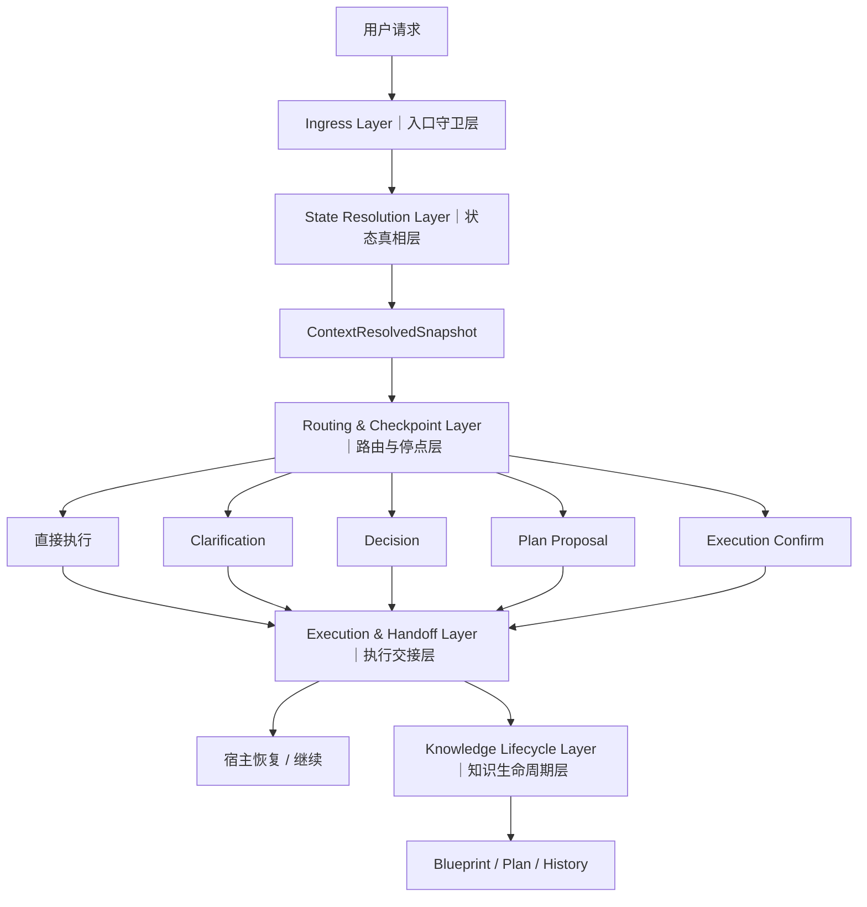

# 蓝图架构与契约

本文定位: 定义 blueprint 的分层方式、runtime 架构与核心消费/停点契约，作为宿主与 runtime 的共同设计基线。

## 正式结论

1. `blueprint/README.md` 只保留入口索引与状态，不承载长说明。
2. 长期知识层固定为 `project.md + blueprint/{background,design,tasks}`。
3. `plan/` 是活动工作层，`history/` 是 `archive_plan` apply 成功后才出现的归档层。
4. `knowledge_sync` 是唯一正式同步契约；`blueprint_obligation` 只保留 legacy reject / projection 语义。
5. `active_plan` 的正式解析口径是 `current_plan.path + current_plan.files`；archive/finalize 的正式解析口径是显式 `archive_subject`，而不是 active flow。

## 第一性原理分层结论

- `user/preferences.md` 承载当前 workspace 的协作风格试运行，包括第一性原理纠偏和局部“两段式协作”偏好。
- `analyze` 只吸收可复用的稳定子集：目标/路径分离、目标模糊先澄清、次优路径给替代、SMART 风格成功标准收口。
- `consult/runtime` 输出层保留为二期配置化能力；“所有问答都两段式输出”不进入当前默认契约。
- promotion gate 的后续跨仓库 Batch 2/3 只用于优化 trigger matrix、示例边界和 threshold 校准，不反向改写本轮 `v1` 分层边界。
- `45` 样本 / `3` 类环境的 round-1 pilot 已完成独立 decision pass，并以 `propose-promotion` 作为正式结论；后续只保留 wording/examples 校准，不再回退本轮 promotion 决策。

### Design Influence Intake Gate

外部项目/方法论的设计影响进入 Sopify 设计文档时，分三级准入：

| 级别 | 名称 | 含义 | 允许出现位置 |
|------|------|------|------------|
| **T0 Reference** | 设计参考 | 启发方向 / 验证已有选择，无实现承诺 | plan 包 design.md |
| **T1 Adoption** | 采纳待验证 | 映射到 ≥1 条哲学 + 有落地路径 + 有验证方案 | plan 包 + 可引用至 blueprint |
| **T2 Principle** | 沉淀原则 | 已实现 + 已验证 + 通过删除测试 | blueprint 级承诺 |

**T0 → T1 准入条件：**
1. 映射到 Loop-first / Wire-composable / Surface-shared 之一
2. 有具体实现路径（哪个方案包、哪个 task）
3. 实现计划含独立验证（测试 / dogfood / review）
4. 不与已有 ADR 结论冲突

**T1 → T2 准入条件：**
1. 至少 1 个方案包实现并通过验证
2. dogfood 期间未回退
3. 通过删除测试（移除后行为真的变化）

每条外部引用应标注：source / tier / philosophy mapping / verification plan。

## 底层哲学

> Sopify 的一切设计决策都可以从以下 3 条哲学推导。它们是 ADR-013（产品定位）、ADR-016（Protocol-first）、ADR-017（Action/Effect Boundary）的共同根基。

### 哲学 1: Loop-first (循环优先)

每个有意义的工作单元都是独立闭环：**produce → verify (isolated) → accumulate → produce**。

- produce: 按复杂度自适应选择快速修复 / 轻量迭代 / 完整方案
- verify: 在独立上下文中验证产出（非生产者自验；cross-review 是该模式的参考实现）
- accumulate: 沉淀到 blueprint/history，构建项目记忆
- loop: 新任务从积累出发，不从零开始

没有 verify 的 produce 是猜测。没有 accumulate 的 verify 是浪费。没有读回 accumulate 的 loop 是断裂的。

### 哲学 2: Wire-composable (线可组合)

独立 loop 通过**线**（机器契约 / 协议约定）组合成大 loop。Sopify 是串联这些小 loop 的线本身——control plane 不做节点内部的事，它负责串联和传递状态。

**线独立于 session / model / host：**
- 中断恢复：读取 handoff + run state → 不同 session 精确继续
- 模型接力：同一组 state 文件，不同 LLM 都能消费
- 宿主携带：`.sopify-skills/` 是纯文件协议，不绑定 runtime

**线的显隐程度可调：**

| 显隐 | 实现 | 适用 |
|------|------|------|
| 显式 (Runtime) | gate JSON → handoff JSON → checkpoint JSON | 确定性门控 / 审计 / 恢复 |
| 隐式 (Convention) | SKILL.md + 目录约定 + lifecycle 规则 | 轻量任务 / 新宿主接入 |

这与 ADR-016 Protocol-first / Runtime-optional 完全对齐——Protocol 定义节点的输入输出 schema，Runtime 是可选的"加固线"。

### 哲学 3: Surface-shared (面共享)

所有线共享一个知识面（blueprint / history）。知识面是跨 session / model / host 的**共享工作记忆**，不只是归档系统。

- 一条线的 accumulate 通过面成为任意线的 produce 输入
- 包括不同 session 中同一条线的续接（跨 session 接力的知识基底）
- blueprint 的读（先验构建）和写（知识沉淀）同等重要

**Sopify 的不可替代性 = 线 + 面的组合。** 宿主未来可以原生做节点（plan/checkpoint），但跨 session/model/host 的线和面需要独立于宿主的文件协议承载——这就是 Protocol-first 的底层论据，也是生存性测试的根基。

### 拓扑全景

```
Sopify = 一条大 loop，串联多个独立小 loop，共享一个知识面

大 loop ──→ [小 loop: 分析] ──→ [小 loop: 设计] ──→ [小 loop: 开发] ──→ [小 loop: 验证] ──→ accumulate ──→ ↩
               p→v→a→p              p→v→a→p              p→v→a→p              p→v→a→p
               (独立)                (独立)                (独立)                (独立)
                                     ↑                                           ↑
                              线 = gate/handoff                           cross-review
                              (显式 or 隐式)                              (独立验证节点)

所有 accumulate 写入同一个知识面：blueprint / history
所有 produce 从同一个知识面读取先验
线可在不同 session / model / host 间中断恢复
```

### 与 ADR 映射

| 哲学 | ADR | 关系 |
|------|-----|------|
| Loop-first | ADR-016 Protocol-first | Loop 的标准化需要 protocol；protocol 的存在理由是让 loop 可复现 |
| Wire-composable | ADR-016 Runtime-optional | 线的显隐可调 = Runtime 是可选的加固层 |
| Wire-composable | ADR-017 Action/Effect | ActionProposal 是线上的过滤器，不是节点 |
| Surface-shared | ADR-013 产品定位 | 面 = 跨宿主的持久价值，是生存性测试的根基 |

---

## 目录分层

Sopify 的知识与运行态继续按五层组织：

- `L0 index`: `blueprint/README.md`，只暴露入口与状态。
- `L1 stable`: `project.md + blueprint/{background,design,tasks}`，承载长期知识与稳定契约。
- `L2 active`: `plan/YYYYMMDD_feature/`，承载当前活动方案与机器元数据。
- `L3 archive`: `history/index.md + history/YYYY-MM/...`，只在 `archive_plan` proposal apply 成功后承载归档。
- `runtime`: `state/*.json + replay/`，承载运行态 machine truth 与可选学习记录。

更细的路径职责、创建时机与 Git 默认策略，以下文 `KB 职责矩阵` 为准。

## Runtime 架构

Sopify 不把开发过程视为一段可以无限续写的聊天上下文，而是把每一轮请求放进一条可恢复的 runtime 主链路：先校验入口，再统一解析当前状态真相，再决定是直接执行还是进入明确的 checkpoint，最后把结果写回结构化 handoff 和项目知识。这样设计的目标，不是增加流程感，而是让复杂任务在跨轮、跨会话、被打断之后，仍然保持可恢复、可评审、可持续推进。

当前底层秩序收敛为五层：入口守卫层、状态真相层、路由与停点层、执行交接层、知识生命周期层。它们分别解决“能不能进入”“现在该信什么”“这轮该怎么走”“结果如何交接”“过程如何沉淀”五类问题。

### Core Layers

#### 1. Ingress Layer｜入口守卫层

入口守卫层负责建立每轮请求进入 Sopify runtime 之前的运行边界。它覆盖安装后的接入上下文、workspace preflight、bootstrap、preferences preload，以及正式 runtime 开始前的 gate 校验。

这一层回答的是两个问题：

1. 当前请求能不能安全进入 Sopify runtime。
2. 当前请求应该带着什么最小上下文进入。

从职责上看，入口守卫层只负责“进门前的准备与校验”，不负责业务路由本身，也不负责解释用户意图。它是 Sopify 的入口协议层，而不是执行器。

#### 2. State Resolution Layer｜状态真相层

状态真相层负责收敛“系统现在到底该信哪份状态”。

Sopify 不允许 Router、Engine、Handoff 各自读取底层状态文件并形成不同解释。当前设计要求先读取当前 session、execution truth 与各类 checkpoint 的候选状态，再由 Loader 与 Resolver 统一生成唯一的 `ContextResolvedSnapshot`。从这一刻起，下游模块只消费 snapshot，而不再重复散读 JSON 文件。

这一层的作用，是把“当前真相”从隐式副作用变成显式裁决。它负责状态统一，不负责决定当前请求应该走 direct execution 还是某个 checkpoint，也不负责生成宿主输出。

#### 3. Routing & Checkpoint Layer｜路由与停点层

> **Action/Effect Boundary (ADR-017 P0)**
>
> 在 State Resolution 完成后、Router 产生副作用之前，插入 ActionProposal 解析与 Effect 授权。host LLM 将用户输入映射为结构化 ActionProposal（action_type + side_effect + confidence + evidence）；Validator 基于 ActionProposal + ValidationContext（从 context_snapshot / current_handoff / current_run 投影的 checkpoint_kind / checkpoint_id / stage / required_host_action）输出统一 ValidationDecision（decision / resolved_action / resolved_side_effect / route_override / reason_code）。Validator 的职责是 pre-write authorization：判断“当前 context 下，这个 action/side effect 是否允许发生”，并在需要时产出最小 artifacts 供下游消费；它不是 executor，不负责 plan materialization、知识写入、文件迁移、自动修复或 runtime 状态推进。局部语境请求被误读为全局推进是通用问题；`write_plan_package` 是首个受控 side effect，不是 Validator 的唯一关心对象。普通命令前缀请求（`~go` 等）仍可作为确定性路由；但 side-effecting command alias 若需要结构化主体，例如 `~go finalize`，必须先映射为对应 ActionProposal（当前为 `archive_plan`），不得绕过 Validator 直达写入。对尚未协议化接管的 action，`fallback_router` 只表示“当前 proposal 不在 Validator 已接管范围内”的临时兼容出口，不表示 Router 获得副作用授权；随着 reserved actions 扩展，`fallback_router` 的职责应单调收缩，而不是承接新的长期能力。详见总纲 design.md ADR-017 及子方案包 `20260428_action_proposal_boundary/`、`20260429_standard-archive-finalize-archive-checkpoint/`。

路由与停点层负责决定当前请求如何推进。

基于 resolved snapshot，runtime 可以进入 direct execution，也可以进入 clarification、decision、plan proposal、execution confirm 等显式 checkpoint。只要事实不足、需要拍板、需要确认是否执行，系统就不会继续向下猜，而是收敛到结构化停点。

这些 checkpoint 的意义，不是“多停几次”，而是把协作中的关键分叉点从聊天语气提升为机器可恢复的交接结构：

- clarification 解决补事实
- decision 解决拍板选路
- plan proposal 解决建包确认
- execution confirm 解决 develop 前最后一次执行确认

这一层负责协作节奏与停点控制，不负责统一状态真相，也不负责长期知识沉淀。

#### 4. Execution & Handoff Layer｜执行交接层

执行交接层负责执行当前 handler，并把结果写成宿主可继续消费的结构化交接。

当请求进入 direct execution 时，Engine 在这一层真正执行当前动作；当请求进入 checkpoint 时，这一层负责将当前停点、下一步要求与上下文摘要写入 `current_handoff.json` 等结构化产物，供宿主恢复与继续。对宿主而言，后续该问什么、等什么、展示什么，优先以 handoff 为准，而不是依赖自由推断。

这一层解决的是“这一轮做了什么，以及下一轮如何继续”。它不负责入口校验，不负责状态裁决，也不负责归档长期知识。

#### 5. Knowledge Lifecycle Layer｜知识生命周期层

知识生命周期层负责把运行过程沉淀成稳定项目资产。

Sopify 采用渐进式物化：

- `bootstrap` 只创建最小骨架
- 进入正式方案流后补齐深层 blueprint
- `finalize` 后才归档进 `history/`

这意味着活动工作、稳定知识和历史归档是三种不同层次的资产，而不是同一个目录下的不同文件名。`plan/` 承载本轮活动方案，`blueprint/` 承载稳定项目认知，`history/` 承载已收口归档；三者相互关联，但不混为一层。

这一层负责资产沉淀，不负责当前轮次的路由判断或冲突恢复。

### Runtime Guarantees

当前 runtime contract 的稳定边界建立在以下保证之上：

- 当前路由真相只解析一次，并在 Router、Engine、Handoff 间一致消费。
- proposal 不再作为当前会话的全局路由真相参与判断。
- execution truth 与 negotiation state 明确分层，不再混用。
- 状态冲突会显式进入 `state_conflict`，而不是默认 silent fail 或直接 fatal。
- `current_run` 与 `current_handoff` 作为同一轮派生结果，需要绑定同一 `resolution_id`，避免半新半旧状态并存。
- `plan/`、`blueprint/`、`history/` 继续保持不同生命周期职责，不被 runtime 混成单层结构。

这些保证的目标，是让复杂协作始终围绕同一个当前真相推进，而不是让不同模块分别持有各自版本的“现在”。

### Active Improvement Areas

当前的主要优化重点，已经不再是底层状态机正确性本身，而是 checkpoint 语境下的宿主侧召回体验。重点包括：

- 区分“只分析一下”和“真的要继续确认” → **ADR-017 P0 thin slice 解决**（ActionProposal + ValidationContext → ValidationDecision pre-route interceptor；详见 `plan/20260428_action_proposal_boundary/`）
- 在显式引用 existing plan 时，保持分析型请求不被误升级为阻断路径
- 提升“取消这个 checkpoint”这类局部语境的自然语言理解稳定性
- 补强 first-hop ingress 的独立诊断与宿主可见性闭环

这些优化的目标，是让停点更容易理解，而不是重新定义当前底层分层边界。

### Follow-up Slice Boundary

- 对 existing plan、checkpoint local action、宿主提示治理的后续优化，层次顺序固定为：先稳定 explicit subject truth，再稳定 checkpoint-local action truth，最后才做 host prompt governance。
- host prompt governance 只消费 stable contract、handoff artifact 与 execution truth；不得代替 resolver / validator 决定 runtime truth，也不得靠自然语言白名单或 keyword patch 触发副作用路径。
- 若 machine truth、subject truth 或 checkpoint truth 未收敛，优先回到 protocol / validator / deterministic guard 修复；不得以 router phrasing patch 或宿主 prompt workaround 充当长期解法。

### Runtime Flow



### Maintenance Rule

后续涉及 installer、runtime gate、snapshot 解析、router、handoff、execution truth 或 knowledge lifecycle 的正式变更，应同步更新本节。若本节继续膨胀，优先拆分为独立架构文档，并在本文件中保留稳定摘要与入口链接，而不是把 `blueprint/README.md` 扩写成长说明。

## 核心契约

### Runtime state scope

- review state 默认落在 `state/sessions/<session_id>/`，覆盖 `current_plan/current_run/current_handoff/current_clarification/current_decision/last_route`
- 根级 `state/` 继续只承载 global execution truth，主要服务 `execution_confirm_pending / resume_active / exec_plan`；archive lifecycle 只在归档主体等于当前 global `current_plan` 时清理对应执行状态
- `session_id` 可以由宿主显式透传，也可以由 runtime gate 自动生成并回传；同一条 review 续轮必须复用同一个 `session_id`
- 并发 review 使用不同 `session_id`；global execution truth 只补 soft ownership 观测字段，不引入 lease / heartbeat / takeover 锁
- clarification / decision bridge 先读 session review state，再回退到 global execution truth，保证 develop 阶段生成的 checkpoint 仍可桥接

### Archive lifecycle contract

- `ActionProposal(action_type="archive_plan")` 是 archive 的协议入口；`~go finalize` 只是 host/CLI alias，必须映射为同一个 proposal，不作为 runtime 内第二条归档入口。
- archive 主体是结构化 `archive_subject`：来自 `ActionProposal.archive_subject` 的 plan id/path，或 validator 认可的唯一 current plan fallback；不得通过 raw request 正则或自然语言词表猜主体。
- archive 固定拆成两层：validator 负责 `validate + authorize + emit artifacts`，校验 action、side effect、subject 与 pending/state conflict；deterministic core 负责 `check + apply`，只读判断主体状态并对 ready managed subject 执行 apply。Validator 不承担迁移、补写或执行责任。
- legacy 或 metadata 不完整主体默认返回 `migration_required/archive_review`，本包不自动 migration/repair；managed ready 主体可单轮 apply。
- Runtime 只负责 gate、ActionProposal 校验、调用 archive core、handoff/output/replay；不拥有 archive 语义，也不把 archive 物化为 execution confirm / resume active。
- 归档只在主体等于当前 global `current_plan` 时清理 `current_run/current_plan`；主体不匹配时不得修改运行态执行事实。
- Guard：不新增 checkpoint type、不新增第二套 archive route、不新增自然语言归档白名单或 raw-text subject regex、不扩展通用 ActionProposal 框架、不把 diagnostics 演化成 migration/repair 平台、不新增通用 document framework。

### Runtime gate ingress contract

- `persisted_handoff` 继续是 runtime gate 的唯一正向机器证据；`runtime_result.handoff` 只用于诊断归因，不替代 persisted 成功证据。
- `evidence.handoff_source_kind` 的稳定值域固定为：`missing / current_request_not_persisted / reused_prior_state / current_request_persisted / persisted_runtime_mismatch`。
- gate 判定优先级固定为：`strict_runtime_entry_missing` 优先，其次区分 `handoff_missing / handoff_normalize_failed`，最后才由 `handoff_source_kind` 决定 `ready` 或 source-kind-specific error。
- `reused_prior_state` 保持允许态；它用于 `~summary` 等不产出新 handoff 的只读恢复路径，不在当前阶段提升为错误面。
- `observability.previous_receipt` 作为稳定诊断面，最小字段固定为：`exists / written_at / request_sha1_match / route_name_match / stale_reason`。
- `observability.previous_receipt.stale_reason` 的稳定枚举固定为：`not_stale / request_sha1_mismatch / route_name_mismatch / both_mismatch / parse_error`。

### 消费契约

| Context Profile | Reads | Fail-open Rule | Notes |
|-----|------|------|------|
| `bootstrap` | `project.md`, `user/preferences.md`, `blueprint/README.md` | 缺深层 blueprint 或 history 不报错 | 只建立最小长期知识骨架 |
| `consult` | `project.md`, `user/preferences.md`, `blueprint/README.md` | 不要求 `background/design/tasks` | 咨询与轻问答不应强行物化 plan |
| `plan` | `project.md`, `user/preferences.md`, `blueprint/README.md`, `blueprint/background.md`, `blueprint/design.md`, `blueprint/tasks.md`, `active_plan` | 若深层 blueprint 缺失，先按生命周期补齐；history 缺失仍可继续 | `active_plan = current_plan.path + current_plan.files`；仅 state 绑定的 plan 视为 machine-active |
| `develop` | `plan` 档位读取集 + `state/*.json` | history 缺失不阻断；长期知识缺失按 `knowledge_sync` 只警告或待 finalize 时阻断 | 默认继续消费当前活动 plan，不回读 history 正文 |
| `archive` | `archive_subject`, `knowledge_sync`, `project.md`, `blueprint/background.md`, `blueprint/design.md`, `blueprint/tasks.md`, `history/index.md` | `history/index.md` 缺失时现场创建；`knowledge_sync=required` 的长期文档未更新则阻断 | `archive_plan` proposal 是协议入口；内部 archive lifecycle 才允许把 L2 写入 L3 |

### `knowledge_sync` contract

```yaml
knowledge_sync:
  project: skip|review|required
  background: skip|review|required
  design: skip|review|required
  tasks: skip|review|required
```

语义固定：

- `skip`: 本轮无需同步该长期文件。
- `review`: 本轮可能受影响，finalize 时至少复核。
- `required`: 本轮必须更新，否则 finalize 阻断。

### 评分输出 contract

正式 plan 包与方案摘要默认带上：

```md
评分:
- 方案质量: X/10
- 落地就绪: Y/10

评分理由:
- 优点: 1 行
- 扣分: 1 行
```

### Checkpoint 契约补充

#### Clarification checkpoint

- 只在 planning 路由内生效，用于补齐最小事实锚点。
- 命中后 runtime 会写入 `current_clarification.json`，并在 handoff 中暴露 `checkpoint_request`。
- 宿主应优先读取结构化问题列表，等待用户补充后再恢复默认 runtime 入口。

#### Decision checkpoint

- 只在 planning 路由内生效，用于处理显式多方案分叉或结构化 tradeoff 候选。
- 命中后 runtime 会写入 `current_decision.json`，并在 handoff 中暴露推荐项与提交状态。
- 宿主确认后再恢复默认 runtime 入口，不得在确认前擅自物化正式 plan。

#### Develop-first callback

- 当 `required_host_action == continue_host_develop` 时，宿主继续负责代码修改。
- 若开发中再次出现用户拍板分叉，宿主必须调用 `scripts/develop_checkpoint_runtime.py` 回调 runtime。
- payload 至少带上 `active_run_stage / current_plan_path / task_refs / changed_files / working_summary / verification_todo`。
- 若只是回传最近一次 task 的质量结果而未触发用户分叉，宿主仍应通过同一个 helper 的 `submit-quality` 子命令上报结构化 develop 质量结果，而不是手写 `current_handoff.json`。
- develop handoff 会暴露 `develop_quality_contract`，其 discovery order、result/root_cause 值域与两阶段复审字段是宿主继续开发时的单一事实源。

#### Execution gate 与 execution confirm

- plan 物化后会写入 `execution_gate` machine contract，区分 `plan_generated` 与 `ready_for_execution`。
- 当 gate 结果为 `ready` 时，runtime 会进入 `execution_confirm_pending`，并通过 `confirm_execute` 等待用户确认。
- 宿主应优先展示 `execution_summary` 中的计划、风险与缓解，而不是直接跳到 develop。
- 若 decision submission 已提交但 machine truth 尚未收敛，视为独立 runtime blocker；宿主不得手工挑选 session/global state 继续。

## KB 职责矩阵

| Path | Layer | Responsibility | Created When | Git Default |
|-----|------|------|------|------|
| `.sopify-skills/blueprint/README.md` | `L0 index` | 项目索引与当前状态 | 首次真实项目触发 | tracked |
| `.sopify-skills/project.md` | `L1 stable` | 可复用技术约定 | 首次 bootstrap | tracked |
| `.sopify-skills/blueprint/{background,design,tasks}.md` | `L1 stable` | 长期目标、契约、延后事项 | 首次进入 plan 生命周期 | tracked |
| `.sopify-skills/plan/YYYYMMDD_feature/` | `L2 active` | 当前活动方案包 | 每次正式进入方案流 | ignored |
| `.sopify-skills/history/YYYY-MM/...` | `L3 archive` | 已收口方案归档 | `archive_plan` proposal apply 成功 | ignored |
| `.sopify-skills/state/*.json` | `runtime` | handoff / checkpoint / gate machine truth | runtime 执行期间 | ignored |
| `.sopify-skills/replay/` | `optional` | 复盘摘要与学习记录 | 命中主动记录策略时 | ignored |

## 治理与参考

- `design.md` 只保留运行分层、知识消费与 checkpoint/同步契约；实现组织与测试布局转移到 [`project.md`](../project.md)。
- public README 只保留新用户需要的价值主张、快速开始、精简目录结构与 FAQ。
- workflow 细节下沉到 `docs/how-sopify-works.md` / `.en.md`，维护者操作统一收口到 `CONTRIBUTING.md` / `CONTRIBUTING_CN.md`。
- promotion gate pilot 的历史工件保留在 `history/2026-03/20260321_go-plan/`；`pilot_sample_matrix.md`、`trigger_matrix.md`、`pilot_review_rubric.md` 作为参考材料存在，不再占据蓝图主体篇幅。
